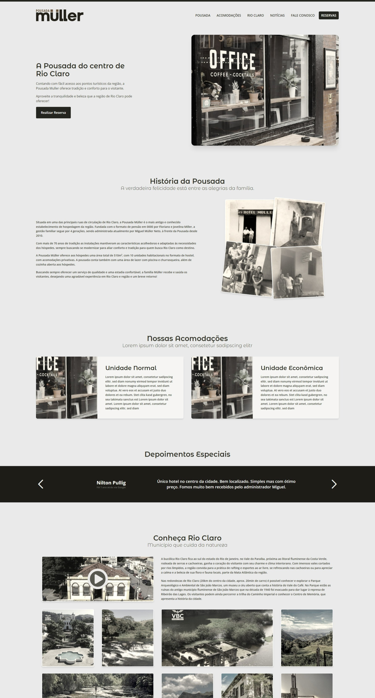

# **Pousada Müller Site**

## **OVERVIEW**
- **Version:** 2.0 
- **License:** Proprietary - Private Use - All rights reserved. 
- **Available for consultation and study only**

Website developed for commercial purposes for Pousada Müller located in Rio Claro in the State of Rio Janeiro. The company that underwent a rebranding had the previous site done in [**WordPress**](https://wordpress.org/) and now has the new version being developed in **[Angular](https://angular.io/)**. Information about this [**older version**](#older-version) can be found in the topic below. 

**Angular** which is an application design framework and development platform for creating efficient and sophisticated single-page apps. It is for building the application interface using HTML, CSS and, mainly, JavaScript, created by Google's developers and has some basic elements that make this construction interesting, within them we can highlight the components, templates, directives, routing, modules, services, dependency injection and infrastructure tools that automate tasks, such as executing the unit tests of an application. 

| [Versão de 2013](http://www.devim.com.br) | [Versão de 2022](https://miguelsmuller.github.io/site-pousada-muller/) |
|:-----------------------------------------:|:----------------------------------------------------------------------:|

## **DOC CONTENT** 
* [Project Requirements](#project-requirements)
* [Running Locally](#running-locally)
* [Project Workflow](#project-workflow)   
* [Contributing](#contributing)
* [Deploy](#deploy)  
* [Older Version](#older-version)  
* [Changelog](#changelog)  

 

# **DEVELOPMENT AND OPERATION**  
## **PROJECT REQUIREMENTS**  
### **INSTALL ALL DEPENDENCIES**
Make sure that you also have **[NodeJS](https://nodejs.org/)** and **[NPM](https://www.npmjs.com/)** installed on your computer.
- **`$ node --version`** 
- **`$ npm --version`** 

Also make sure you have **Angular CLI** and **Ionic CLI** installed globally on your machine.  
- **`$ npm install -g @angular/cli @ionic/cli`**  

Install dependencies of project with:  
- **`$ npm install`**

 

## **RUNNING LOCALLY**  
Run te command  
**`$ ng serve`**

 

## **PROJECT WORKFLOW**  
This workflow uses two main branches to record the project's history. The **`master`** branch stores the official release history, and the **`develop`** branch serves as a resource integration branch.

The branch **`master`** is the branch that runs in the production environment. All commits on the **`master`** branch must have a version number.

Each new resource must reside on its own branch and must start from the **`develop`** branch. When a feature is completed, it is merged back into **`develop`**. Resources should never interact directly with the master.

The branch **`develop`** is the branch that runs in the test environment. It stores the latest features included in the projects and which are not yet able to enter the branch **`master`**. 

 

## **CONTRIBUTING**  
#### **REPORTING PROBLEMS**  
To report an issue, please [create a new pull request](https://github.com/miguelsmuller/site-pousada-muller/pulls).  

#### **SENDING CODE**  
Before sending your collaboration, check your code and the conventions adopted in the project and take the following steps:

- Always check the branch used: **`$ git status`**
- Update your branch: **`$ git pull`**
- Rebase your branch: **`$ git rebase -i HEAD~N`**
- See the differences before committing: **`$ git diff --cached`**
- Delete locally develop branch: **`$ git branch -d develop`**
- Delete remotely develop branch: **`$ git push origin --delete develop`**
- Recreate develop branch: **`$ git checkout -b develop`**

#### **IMPORTANT INFORMATION**  
- Do not commit before running the project locally
- See the changes implemented being carried out
- And especially make sure that these changes work
- **[Useful git commands](https://gist.github.com/leocomelli/2545add34e4fec21ec16)** 

 

## **DEPLOY**  
Provisionally while the site is not in production the depoly will be done on github pages for being a free and easy to use alternative to host our website.
- Generate production version with -  **`$ npm run build:prod`**
  - A folder will be created in the same directory as the current project 
- Access the created folder **`$ cd ./www`**
- Init git with: **`$ git init`**
- Add a origin with: **`$ git remote add origin git@github.com:miguelsmuller/site-pousada-muller.git`**
- Create a branch gh-pages with: **`$ git checkout -b gh-pages`**
- Add, Commit and Push with:
  - **`$ git add --all`**
  - **`$ git commit -m "Preview Site"`**
  - **`$ git push -f -u origin gh-pages`**
- See the result

 

##  **OLDER VERSION**  
The old version of this site can be found for study at the GitHub repository **[Site Hotel Muller](https://github.com/miguelsmuller/site-hotel-muller)**. The repository is archived for historical reference only.

 

## **SCREENSHOT**

